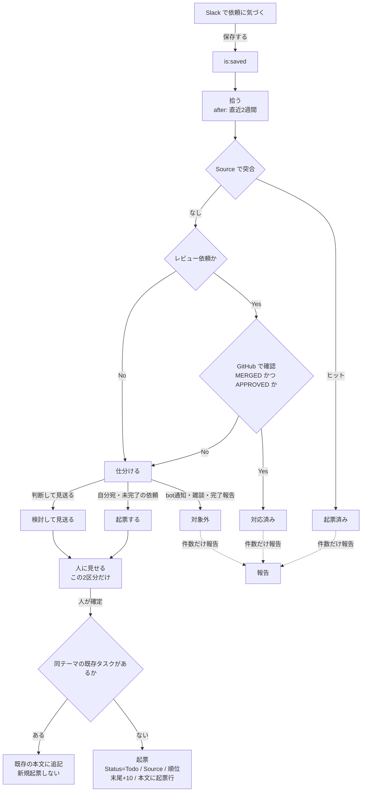
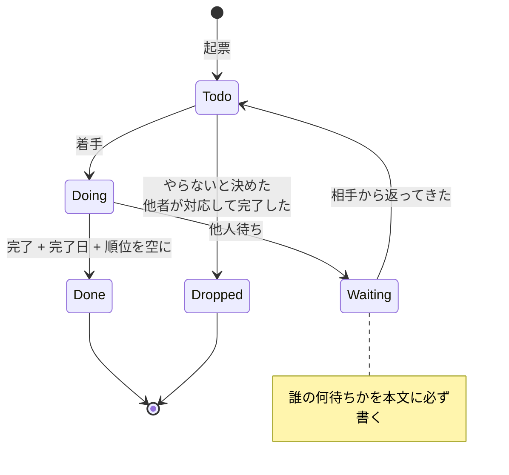

# タスク管理システム

Notion 上の個人タスクを AI エージェント（Claude Code / Codex）から操作するための定義。
**使いながら育てる。** 決まっていないことは §6 にまとめてある。

> このファイルには識別子・固有名詞を書かない。
> 実際の DB id・命名・実例は同じディレクトリの `docs/task-system/private.md` にある。
> **操作前に private 側を必ず併せて読むこと**（読み取り規約は `instructions/core.md` を参照）。

---

## 0. 操作の前に

- Notion のタスクを触る前に、このドキュメントと private 側の両方を読む
- **対象 DB は private 側に記載の id で指定する。`notion-search` で探さない**（旧 DB に誤って書く事故が起きる）
- private 側が存在しない、または id が未記入なら、作業を止めて確認する

---

## 全体像

Slack から拾って起票するまで。詳細は §5。



起票したあとのタスクの動き。詳細は §3・§4。



**Status を変えたら本文に1行追記する。** これが振り返りの材料になる。

---

## 1. 対象 DB

現行 DB の名称・data source id・database id・ID prefix は **private 側の §1** に置く。

クオータごとに DB を分ける（会計年度の区切りは private 側に記載）。
過去 DB は参照のみで、書き込まない。

---

## 2. スキーマ

| プロパティ | 型 | 説明 |
|---|---|---|
| `Name` | title | タスク名。**人間が入力する唯一の必須** |
| `Status` | select | `Todo` / `Doing` / `Waiting` / `Done` / `Dropped` |
| `順位` | number | 実行順。小さいほど先。**10刻み**で振る |
| `Due` | date | 期限。無ければ空 |
| `Project` | select | 成果の分類。**振り返りで語る単位**（下記） |
| `完了日` | date | `Done` / `Dropped` にした日。振り返りの集計に使う |
| `役割` | select | `主担当` / `レビュー` / `関与のみ`。**振り返りで自分の成果を切り出す軸**（下記） |
| `Source` | text | 起点のメッセージ。`{channel_id}/{message_ts}` |
| `ID` | unique_id | 会話での参照用。自動 |

人間が触るのは `Name` と `Status` だけ。他は AI が埋める。

> 前期は `優先度` が109件中1件しか埋まっていなかった。
> **AI が埋められないプロパティは作らない。**

`順位` を10刻みにするのは、連番だと割り込みのたびに全件書き換えになるため
（Notion に一括更新 API はない）。`Done` / `Dropped` にしたら空にする。

`Source` は Slack から起票したときだけ入る（口頭起票・会議発は空）。
**空は「突合の対象外」であって「未処理」ではない。**
本文の `[Slack](slackMessage://...)` は残す —— あちらは人が飛ぶため、`Source` は機械が突き合わせるため。

### `Project` の分類（2026-08-13 再設計）

**査定の振り返りで1トピックとして語れる粒度**にそろえてある。

| Project | 発生源 | 効く先 | 何を入れるか |
|---|---|---|---|
| プロダクトバックログ | ビジネス | プロダクト | 計画開発。新しい生成タイプ・新媒体対応・外部システム連携・画面追加 |
| 開発バックログ | エンジニア | プロダクト | 技術負債・品質・信頼性・調査・コスト・セキュリティ |
| 開発プロセス改善 | エンジニア | チーム | 会議体・レビュー体制・ドキュメント・AIエージェント整備 |
| 定常業務 | 依頼 | — | 個別案件の対応、他人の PR レビュー、定例・全社施策の事務 |

- **プロダクトバックログか開発バックログかは「誰が言い出したか」で決める。**
  依頼を受けて機能が増えるならプロダクト、自分たちで見つけて直すなら開発
- **不具合対応はどちらにも見える。** 依頼を受けて直したならプロダクト、自分で気づいて直したなら開発
- 選択肢の色と並び順が層を表す（緑＝事業に効く / 青・黄＝内部に効く / グレー＝定常）

**なぜ作り直したか。** 旧分類は `運用` / `プロダクトA` / `施策Y` / `ドキュメント整備` / `プロダクトB v1.1` / `Argo移行` /
`外部連携X` / `運用・改善：プロダクトA` の8つで、プロダクト軸・活動の性質軸・施策軸が混在していた。
結果、同じ PR レビューが `プロダクトA` と `運用` に割れ、`運用`（全体の31%）の中に
「バックログ会の刷新」と「定例FMTの記入」が同居して、振り返りで語れるものと語れないものが分離できなかった。
未使用の選択肢も2つあった。

**プロダクト軸は捨てた。** 「プロダクトA の仕事をどれだけしたか」は Project から引けない。タスク名の検索で追う。

### `役割` の分類（2026-08-14 追加）

**`Done` の中には、自分が主体で完遂したものとそうでないものが混ざる。** それを切り分ける軸。

| 役割 | 何を入れるか |
|---|---|
| `主担当` | 自分が設計・実装・遂行した |
| `レビュー` | 他者の成果物にレビュー・判断を返した |
| `関与のみ` | 起点や調査に関わったが、実作業は他者がやった |

- **`Done` / `Dropped` にするときに埋める。** 未完了のあいだは空でよい
- 迷ったら**タスク名が示す成果物を誰が出したか**で決める。
  例: 「〜の切り分け」なら切り分けた人。修正を他者がリリースしても `主担当`
- 色は緑＝自分の成果 / 青＝他者の成果への貢献 / グレー＝手放した

**なぜ足したか。** 導入時点の完了済み22件は `主担当` 14 / `レビュー` 6 / `関与のみ` 2 で、
**`Done` の 38% が自分が主体で完遂したものではなかった**。
`Status = 'Done'` で数えると21件だが、査定で語れるのは14件。
`Project` では分けられない —— `定常業務` の中にレビュー6件と自分の作業7件が同居していた。

**`優先度` と違って AI が埋められる。** PR の author が自分か、
実作業を誰がやったかは GitHub と Slack の一次情報で決まる（主観が要らない）。
**プロパティは 8 → 9 に純増した。** 代わりに削れるものは無かった。

### `Updated` を削除した理由（2026-08-10）

`last_edited_time` は**本文を1行足すだけで今日になる**ため、放置の判定にも完了日にも使えなかった。
実際、本文に「2026-08-07 レビュー完了」とあるタスクの `Updated` が 8/10 に飛んでいた
（`Source` を後から埋めたせい）。参照する場面が1つも無いので削り、代わりに `完了日` を足した。
**プロパティは増えていない。**

---

## 3. 本文タイムライン

経緯はプロパティではなく、**ページ本文に追記する**。

```markdown
- 2026-08-07 起票。<背景を1行>
- 2026-08-09 Waiting: <誰>の<何>待ち
- 2026-08-16 マージして完了
```

- `- YYYY-MM-DD <内容>` の1行
- **`Status` を変えたら1行追記する**。特に `Waiting` は**誰の何待ちか**を必ず書く
- `insert_content`（`position: end`）で追記する。プロパティ更新とは別コールになる

Notion のプロパティは上書きしかできないため、経緯を持たせると履歴が消える。
本文なら「誰に何回催促したか」が残る。

### レビュー依頼系は対象へのリンクも入れる

**Slack リンクだけでは「何をレビューすべきか」に辿れない。**
起票時に、Slack に加えて**レビュー対象そのもののリンク**を本文に入れる。

- GitHub の PR、Notion ページ、Figma など、実際に開いて見るもの
- **1つの依頼に複数ある場合は全部並べる**（PR が3本まとめて依頼されることがある）
- リンクが本文にあれば、あとで GitHub の `state` を突き合わせるときに探し直さなくて済む

> 実際の記入例は private 側の §3 にある。

---

## 4. ビュー

| ビュー | 内容 |
|---|---|
| **Now** | `Todo` / `Doing` / `Waiting` を `順位` 昇順 ← **主画面。上から順にやる** |
| **Done** | 完了・見送りを `完了日` 降順 |

**`Waiting` 専用ビューは廃止した（2026-08-14）。** 他人待ちだけを眺める場面が無く、
Now に混ぜても `Status` 列で判別できる。順位づけで同種内末尾に置くルール（§5）があるため、
着手対象の先頭を埋めることもない。

**ビュー名に emoji を入れない。** 装飾は Notion のビューアイコンで付ける（名前は文字だけ）。

---

## 5. 使い方

### 起票
```
「〇〇のタスク登録して」
```
`Name` を確定し、`Project` と `Due` を推論。`Status = Todo`、`順位` は末尾 +10。
本文に起票行を1行入れる。`Project` は §2 の4分類から選ぶ（迷ったら発生源で決める）。

**ただし種類が「順位づけ」の 1〜3（運用の一次対応 / 期限が迫る / レビュー依頼）なら、末尾ではなくその種類の位置に割り込ませる。**
末尾 +10 に置くと埋もれて、次の順位整理まで着手されない。割り込ませる場合は**提示した順位で `y/n` を取る**。

### Slack の保存済みから起票
```
「slack の後でを見て、起票していないタスクがあったら起票して」
```
**保存するだけでよい。マーカー絵文字は使わない**（2026-08-12 廃止）。
拾う条件は `is:saved` だけ。絞り込みは AI の仕分けと `Source` 台帳が肩代わりする。

プライベートチャンネル・DM を含めるには `slack_search_public_and_private` が要る。
間隔が空いたときは `after:YYYY-MM-DD` で**直近2週間程度に絞る**。
それ以前は「流れたもの」として拾わない（全件だと量が多く、レビューが形骸化する）。

#### 手順

1. **拾う** — `is:saved after:{2週間前}`
2. **突合する** — `WHERE "Source" IS NOT NULL` で既存タスクを全件取得し、
   手元で `{channel_id}/{message_ts}` を突き合わせる。`Dropped` でヒットしたら「見送り済み」
3. **レビュー依頼は GitHub で確認する** — PR の `state` と自分の review を見る。
   `MERGED` かつ自分が `APPROVED` 済みなら**対応済み**。スレッドを読む必要はない
4. **仕分ける** — 下の原則で3つに分ける
5. **見せる** — 「起票する」「検討して見送る」の**2区分だけ**表で出す。
   「起票済み」「明らかに対象外」は**件数だけ**報告する（表が長いほど見送り列が読み飛ばされる）
6. **人が確定してから書き込む**

#### 仕分けの原則

> **自分に向けられた、まだ完了していない依頼・宿題**が起票候補。それ以外は対象外。

対象外の典型（表に出さず件数だけ数える）:

| 型 | 例 |
|---|---|
| bot 通知 | 労務・勤怠・評価システムからの DM |
| 完了報告 | 「対応しました」「コメント返しました」 |
| 雑談・誘い | イベントや遊びの誘い |
| 情報共有 | 記事 URL ＋所感 |
| 自分の発言 | 自分が投げた依頼・確認 |

#### 既存タスクに寄せる判断

**同じテーマの既存タスクがあれば、新規起票せず本文に追記する。**
`Source` が空の既存タスク（前期からの再起票など）は機械突合をすり抜けるので、
タスク名でも見比べること。

> 実例: 運用担当から来た「スロット66/67 が description 欠落で 100% 失敗」の報告は
> `媒体A固定レスポンシブ 生成前スキップ` の具体事例だった。別で起票していたら分裂していた。
> 同様に、レビュー依頼の PR が既存タスクと同じテーマのこともある。

#### なぜマーカーをやめたか

Slack の「後で」は完了状態が**どこからも読めない**（`is:saved` は完了済みも返す。
旧 `stars.list` は廃止、後継の saved items API は非公開、MCP にも該当ツールなし）。
そのため以前は「起票するものに印を付ける」向きにしていたが、
`Source` で**処理済みを台帳から判別できる**ようになったため、印が要らなくなった。

### 順位づけ
```
「順位整理して」「今の状況は？」
```
未完了を並べ替えて10刻みで振り直し、**全件を順位つきで提示**する（上位N件に絞らない）。
**なぜその順かを1行添える。**

順位は**タスクの種類**で決まる。上から順に:

| 順 | 種類 | なぜこの位置か |
|---|---|---|
| 1 | **運用からの問い合わせの一次対応** | 相手は業務を止めて待っている。原因調査より**一次回答**を先に返す |
| 2 | **期限が迫っているもの** | 過ぎると機会そのものが消える（定例の記入、全社施策の提出物） |
| 3 | **レビュー依頼** | **他人を止めている**。自分の実装より軽く、返すだけで相手が動ける |
| 4 | **プロダクトバックログ開発** | 計画済みの開発。期限も他人待ちもない |
| 5 | **その他** | 自主改善・ドキュメント整備など |

- **同じ種類の中は `期限` → 起票日が古い順 → 軽さ で並べる**
- **古さは `createdTime` で見る。** 本文に書かれた元の依頼日は使わない
  （同じ「4ヶ月前の依頼」でも、台帳に載せた日が実際に自分が抱えている期間）
- **古さは軽さより優先する。「軽いから先に片付ける」で新しいものを上げない。**
  これが無いと、外から降ってくるレビュー依頼が常に上位を占め、
  自主改善（種類5）が構造的に着手されないまま溜まる
- **同じ種類・同じ起票日なら `Doing` を先に置く。** 着手済みのものを中断させない
- **依頼者の稼働状況（不在など）で並べ替えない。** 言われたときだけその場で反映する
- **`Waiting` は種類の位置を保ったまま、同種内では末尾に置く。** Now ビューに並ぶが、
  同種内で後ろに来るので着手対象を埋めない（順位を空にすると再開時に埋もれる）
- **運用の恒久対応は 1 ではない。** 一次回答を返した時点で別タスクに切り、4 以下へ回す
- 期限が先のもの（数ヶ月後）は 2 ではなく、実質 4〜5 として扱う
- **`Due` が空でも、相手に日付を切って約束した連絡・報告が残っているものは 2 に数える。**
  「反映したら連絡します」と言ったまま放置しても催促が来ないため、`Due` にも `Waiting` にも現れない。
  **相手は待っていることを言い出せないまま止まっている**ので、期限があるものと同じ扱いにする

期限超過や長く動いていないものがあれば併せて知らせる。

### 実行
```
「{ID prefix}-12 やる」    → Doing
「{ID prefix}-12 終わった」 → Done + 順位を空に
```
`Status` を変えたら本文に1行追記する（§3）。
`Done` にしたら `完了日` も埋める。
名前で指定されて候補が複数あれば確認する。

#### 自分以外が対応して完了したときは `Dropped`

`Done` にすると振り返りの集計に**自分の成果として乗ってしまう**。
**`Dropped` にして `完了日` は入れる**（順位は空にする）。

- 振り返りは `Status = 'Done'` かつ `役割 = '主担当'` で絞るため、`Dropped` は自動で集計から外れる
- `完了日` を入れるのは**いつ決着したかを残すため**。空にして外す手もあるが、
  それでは**単なる記入漏れと区別できない**
- **本文に「誰が対応したか」と「自分の関与（レビューのみ等）」を書く**
- `Dropped` は「やらないと決めた」だけでなく「**自分のタスクとしては手放した**」も含む
- **`役割` も併せて埋める**（§2）。手放したものは `関与のみ`、
  やらないと決めただけのものは空でよい

### `Dropped` と `Done` + `役割` の使い分け

**寄与したかどうかで決める。**

| 状況 | Status | 役割 |
|---|---|---|
| 他者の PR にレビューを返して完了 | `Done` | `レビュー` |
| 他者の PR に `APPROVED` を出したがまだマージされていない | `Done` | `レビュー` |
| 自分が調査・判断し、実作業は他者 | `Done` | `関与のみ` |
| 自分は何も寄与せず他者が完結させた | `Dropped` | `関与のみ` |
| やらないと決めた | `Dropped` | （空） |

**`APPROVED` を出した時点で `Done` にする。マージを待たない。**
レビュー依頼タスクの成果物は「レビューを返すこと」で、マージは相手の作業。
`完了日` は**レビュー提出日**を入れる（マージ日ではない）。
§5「Slack の保存済みから起票」の「`MERGED` かつ `APPROVED` なら対応済み」は
**起票候補を突合するための判定**であって、完了の条件ではない。
`COMMENT` で返した場合は相手のボールなので `Waiting`（`Done` にしない）。

`役割` が入ったので、**自分の成果として集計されるのを避けるために `Dropped` へ逃がす必要はなくなった。**
寄与があるなら `Done` にして `役割` で区別する（何をしたかが残る）。

自分がレビューした分は、レビューとして別に数えれば足りる（§5 振り返り）。

#### 着手したらその場で `Doing` にする（最も忘れやすい）

**タスクの作業を始めた時点で `Doing` に変える。終わってからまとめて直さない。**

- **「やる」と言われるのを待たない。** 調査・実装・回答の作成に手をつけたら、その時点で自分で変える
- **タスクを開いて状態を見たときも、実態と `Status` がずれていればその場で直す。**
  「あとで直す」は直らない。ずれた台帳は順位づけと振り返りの両方を狂わせる
- 変えたら本文に1行追記する（§3）。着手時は「何から見るか」を書いておくと再開が速い

これは `Waiting` からの復帰でも同じ。相手から返答が来て自分が動き始めたら `Doing` にする。

### ステータスの更新（AI が状態変化を検知した場合）

```
「slack を確認して、タスクの最新のステータスを更新して」
```

人が「終わった」と言ったならそのまま変えてよい。
**AI が Slack や GitHub を見て状態変化を見つけた場合は、書き込む前に表でレビューを受ける。**

| ID | 項目 | Before | After | 根拠 |
|---|---|---|---|---|
| 30 | Status | `Todo` | `Done` | `<repo>#1136` が `merged=2026-08-12T02:30:42Z by=<PR作者>`。自分の review は `APPROVED` |
| 30 | 順位 | `90` | （空） | §2「`Done` / `Dropped` にしたら空にする」 |

- **根拠は一次情報で書く** —— PR の `state` / マージ時刻 / Slack の発言と時刻。「〜のはず」は書かない
- **1プロパティ1行**にする。Status と 完了日 と 順位 をまとめない（どれが根拠に対応するか分からなくなる）
- **判断が弱いものはそう書く。** 例: PR の review が `COMMENTED` のとき、
  `Waiting`（相手にボールを返した）か `Doing`（レビュー継続中）かはコメント本文を読まないと決まらない
- 確定してから書き込み、本文にも1行追記する

### 振り返り
```
「今週やったこと」「今期やったこと」
```
`Status = Done` を `完了日` で絞り、**`役割` で語る対象を切り出す**。

```sql
WHERE "Status" = 'Done' AND "役割" = '主担当'
  AND date("date:完了日:start") >= date('YYYY-MM-DD')
```

`Project` で束ねて件数と一覧を出す。ここまでが素材づくり。

**`レビュー` と `関与のみ` は件数だけ添える。** 語る対象は `主担当` に絞る。
`役割` を外して数えると件数は膨らむが、**1件ずつ語ろうとすると薄い本文を厚くする作業が始まる**。

**まとめ方はその都度決める。** 読み手（査定シート・上長・自分用のメモ）で必要なものが変わるため、
語る順番も粒度もここでは固定しない。`Project` は**素材を束ねる軸**であって、語る順番ではない。

> 本文の厚さは実際に両極に割れている。自分で設計・判断したものは厚く、レビュー依頼は薄い。
> 薄いものを厚くしようとせず、**語る対象を選ぶ**ことで総括を成立させる。

---

## 6. まだ決めていないこと

**先回りして決めない。必要になった時点で、実際に困ったことに合わせて決める。**

| 項目 | いま分かっていること |
|---|---|
| **クオータ切り替えの手順** | 最初の1回が来たときに決める。未完了の繰り越し漏れだけ注意する（前期は7ヶ月放置されたタスクがあった）。`Source` の突合を過去 DB まで広げるかもここで決める |
| **放置タスクの扱い** | 起票日（`createdTime`）で見る。`Updated` は使えないと分かったので削除した（§2） |
| **人間が Notion UI で直接 Status を変えたとき** | 本文の追記も `完了日` の記入も発生しない。困り始めたら回収方法を考える |
| **見送りを台帳に残すか** | 「検討して見送った」を `Status = Dropped` で載せる案がある。**Slack 起票時の見送りはまだ一度も書き込んでいない**（3回の運用では報告のみで済んだ）。同じものが再度候補に上がって煩わしくなったら入れる。なお `Dropped` 自体は 2026-08-12 に別用途で初使用した（他者が対応して完了したタスク1件。§5「自分以外が対応して完了したときは `Dropped`」） |
| **対象外の再出現** | bot 通知や雑談は台帳に載せないので毎回候補に上がる。判定が安定しているので今は許容。件数が増えて邪魔になったら考える |

### 育て方

- **ルールは、実際に困ってから足す。** 想像で足さない
- **足すときは、代わりに何か削れないか考える**
- クオータ切り替えのタイミングで、使われなかったプロパティ・ルールを1つ見直す
